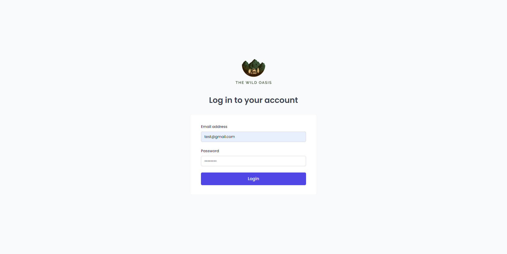
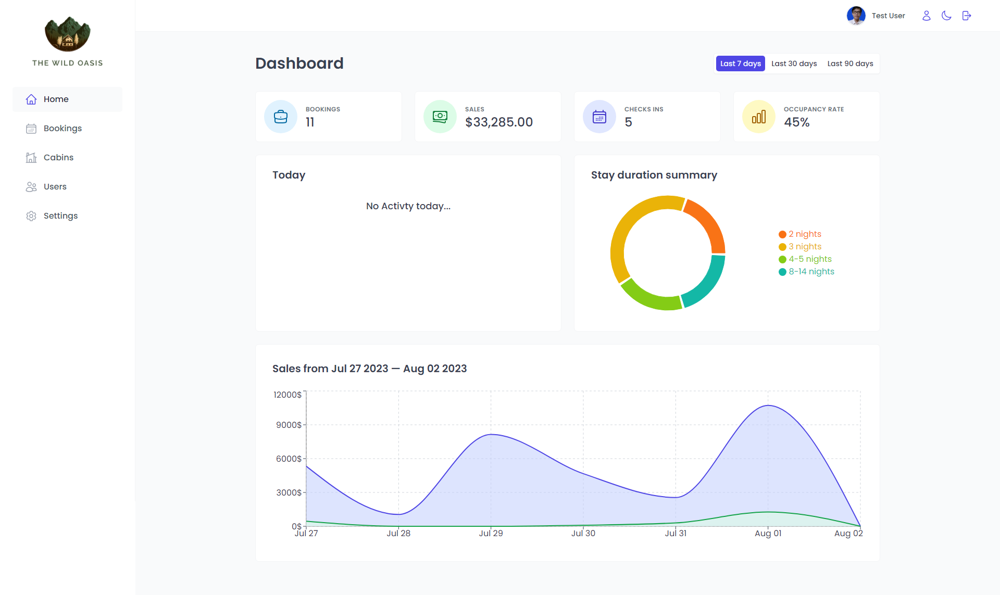
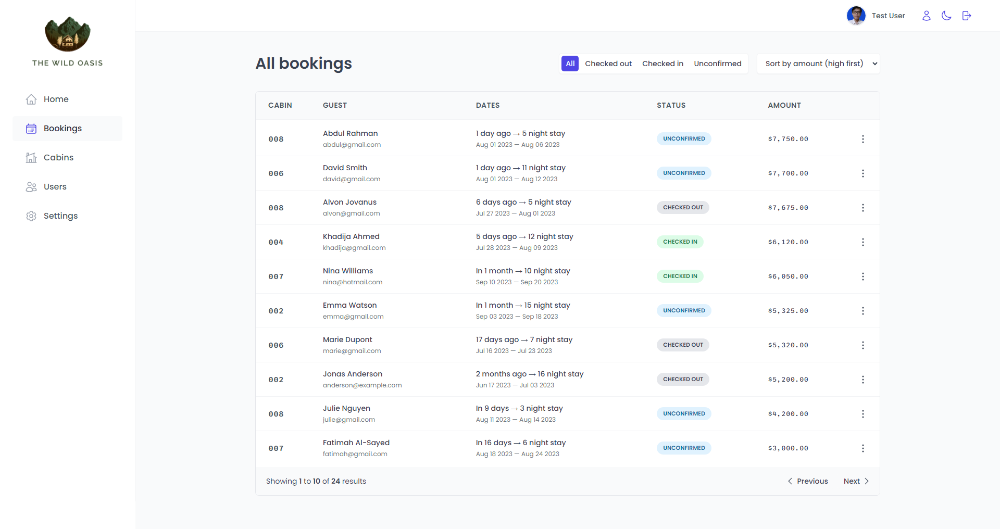
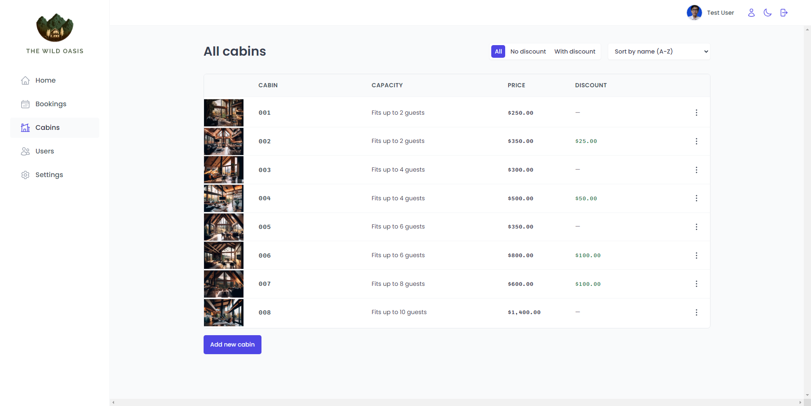
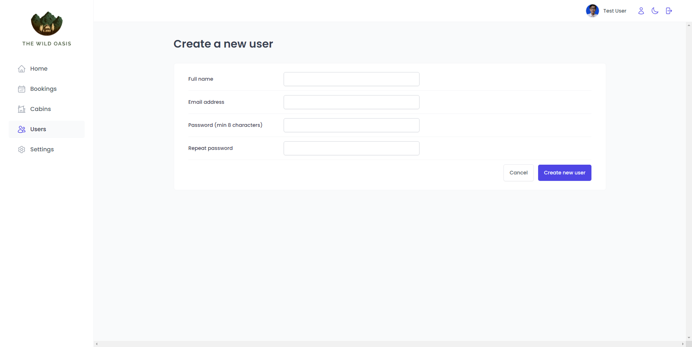
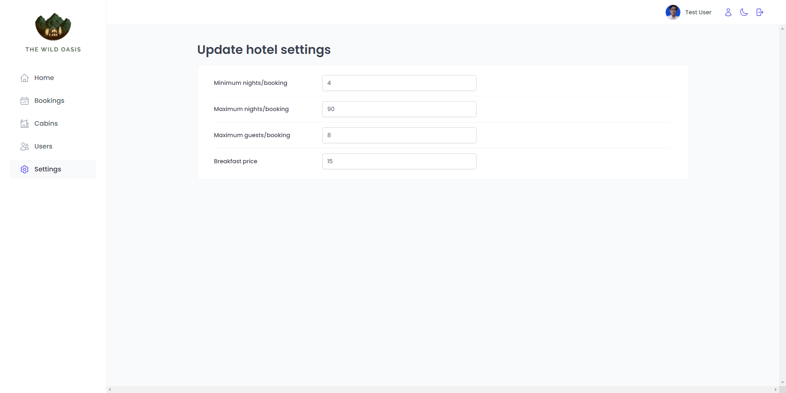
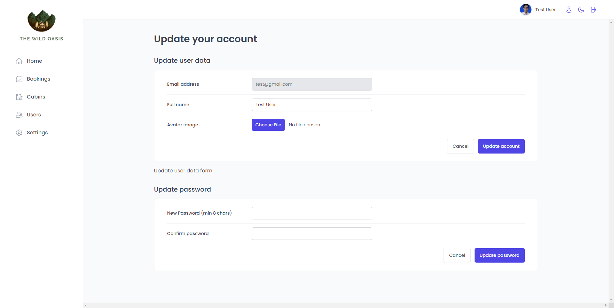

# Cabin Booking Web Application

This is a React web application designed for booking cabins, featuring robust authentication and authorization functionalities. The project utilizes Supabase as the database service to manage user data and booking information. The dashboard includes an interactive chart, and users can switch between light and dark modes for a personalized experience.

## Technologies Used

- **HTML**: Standard markup language for creating the structure of web pages.
- **CSS**: Cascading Style Sheets for styling the application.
- **JavaScript**: Programming language for client-side scripting.
- **React.js**: A JavaScript library for building user interfaces.
- **Supabase**: An open-source alternative to Firebase, serving as the database service.
- **React Query**: A library for managing, caching, and updating server state in React applications.
- **React Icons**: A library for including popular icons in React projects.
- **React Router**: A standard library for routing in React applications.
- **Styled Components**: A CSS-in-JS library for styling React components.
- **Recharts**: A charting library built on React components.
- **Vite**: A fast and lightweight build tool for modern web development.

## Features

1. **User Authentication and Authorization**: Secure user authentication and authorization mechanisms are implemented to ensure the safety and privacy of user data.

2. **Supabase Integration**: Utilizes Supabase as the backend database service, providing a scalable and reliable data storage solution.

3. **React Query for State Management**: Implements React Query for efficient management, caching, and updating of server state in the React application.

4. **Responsive Dashboard with Chart**: The dashboard includes an interactive chart for visualizing data related to cabin bookings, providing users with valuable insights.

5. **Dark Mode**: Users can switch between light and dark modes to customize their visual experience and reduce eye strain in low-light environments.

## Getting Started

1. Clone the repository.
2. Install dependencies using `npm install` or `yarn install`.
3. Set up the Supabase database and configure the necessary environment variables.
4. Run the application using `npm start` or `yarn start`.
5. Access the application in your web browser at `http://localhost:3000`.

## Contributing

If you'd like to contribute to this project, please follow the [contributing guidelines](CONTRIBUTING.md).

## License

This project is licensed under the [MIT License](LICENSE).

---

Feel free to modify this `README.md` file to suit the specific details and structure of your project.

## Link Website

https://wild-oasis1.netlify.app/

| Email Address  | Password |
| -------------- | -------- |
| test@gmail.com | 12345678 |

## Screenshot

| Login Page                                   |
| -------------------------------------------- |
|  |

| Dashboard Page                                   |
| ------------------------------------------------ |
|  |

| Bookings Page                                   |
| ----------------------------------------------- |
|  |

| Cabins Page                                   |
| --------------------------------------------- |
|  |

| Users Page                                   |
| -------------------------------------------- |
|  |

| Settings Page                                   |
| ----------------------------------------------- |
|  |

| Edit user Page                                   |
| ------------------------------------------------ |
|  |

## Installation

Clone and move to the repository

```bash
git clone https://github.com/MonasefDev/wild-oasis.git
cd the-wild-oasis

# install packages
npm install
# run the server
npm run dev

```
